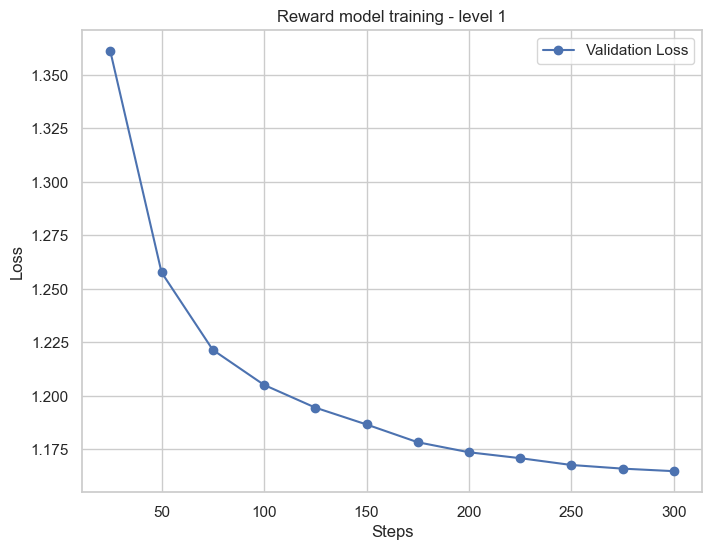
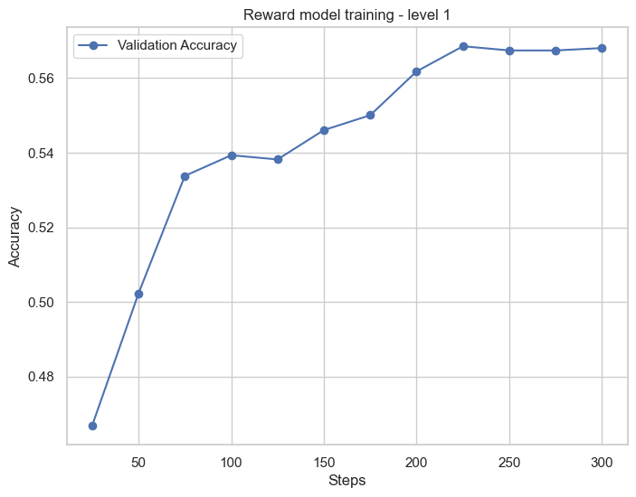
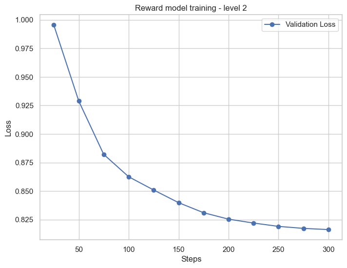

# [REINFORCE paper](https://arxiv.org/pdf/2402.14740) implementation

RLHF [[1]](https://arxiv.org/pdf/2203.02155) — фундаментальный метод алаймента языковых моделей, который применялся при обучении ChatGPT, LLama 2, Qwen 2.5 и т.д. Как известно RLHF очень требователен к ресурсам и чувствителен к гиперпараметрам. Сложность данного метода обоснована сложностью алгоритма PPO [[2]](https://arxiv.org/pdf/1707.06347), который лежит в основе RLHF.

Статья **Back to Basics** [[3]](https://arxiv.org/pdf/2402.14740) предлагает использовать более простой алгоритм REINFORCE для алаймента языковых моделей. Согласно результатам данной работы, данный алгоритм не только проще в реализации, но и показывает лучшие метрики, чем PPO.

## Level 1

Реализация алгоритма *REINFORCE w/ baseline* для алаймента языковых моделей.

### Reward model

- **Задача:** обучить классическую reward модель с одним выходным значением - скалярной оценкой.

- SFT модель: [HuggingFaceTB/SmolLM2-135M-Instruct](https://huggingface.co/HuggingFaceTB/SmolLM2-135M-Instruct)

- Датасет: full (8k) average rating split of [esfrankel17/HelpSteer2_binarized](https://huggingface.co/datasets/esfrankel17/HelpSteer2_binarized)

- Used: trl.RewardTrainer, LoRa

- [Reward model training config](#reward-model-config)

- [Ноутбук с кодом](https://github.com/MilyaushaShamsutdinova/REINFORCE_implementation/blob/main/src/level_1/reward_model_training.ipynb)

- Полученная модель: [MilyaShams/SmolLM2-135M-Instruct-Reward](https://huggingface.co/MilyaShams/SmolLM2-135M-Instruct-Reward).

- Результаты тренировки

    Наблюдается стабильное уменьшение лосса и увеличение точности.
    <!-- 
     -->

    

### Policy model

- **Задача:** реализовать алгоритм REINFORCE w/ baseline [[3]](https://arxiv.org/pdf/2402.14740) для обучения policy модель. Реализация через Moving average для подсчёта baseline, без RLOO.

> Почему не использовать RLOOTrainer? Чем отличается от моего подхода?
> TO-DO

- SFT модель: [HuggingFaceTB/SmolLM2-135M-Instruct](https://huggingface.co/HuggingFaceTB/SmolLM2-135M-Instruct)

- RM модель: [MilyaShams/SmolLM2-135M-Instruct-Reward](https://huggingface.co/MilyaShams/SmolLM2-135M-Instruct-Reward)

- Датасет: part (4k, choosing not long prompts) of average rating split of [esfrankel17/HelpSteer2_binarized](https://huggingface.co/datasets/esfrankel17/HelpSteer2_binarized)

- Used: Pytorch, LoRa, GradScaler

- [Policy model training config](#policy-model-config)

- [Ноутбук с кодом](https://github.com/MilyaushaShamsutdinova/REINFORCE_implementation/blob/main/src/level_1/reinforce_with_baseline.ipynb)

- Результаты тренировки

    | Training progress| Avg reward         |
    | ---------------- |:------------------:| 
    | no training      | 0.4745             |
    | epoch 1          | **0.5027**         |

    Cредняя награда выросла на отложенной выборке (validation split) по сравнению c SFT моделью.

## Level 2

Эксперименты с *вероятностной Reward Model*.

### Reward model

- **Задача:** обучить Reward Model, которая выдаёт не скалярную оценку, а распределение вероятности поверх дискретных оценок. Пусть оценка текста — натуральное число от 1 до 10, тогда RM выдаёт 10 чисел, каждое из которых — вероятность текста получить соответствующую оценку.

    Так как наша цель максимизировать вероятность $p(y_w \succ y_l | x)$, следовательно мы можем определить функцию потерь как $-log(p(y_w \succ y_l | x))$. Таким образом, минимизация этого лосса эквивалентна максимизации вероятности предпочтения $y_w$.

    Objective: max($p(y_w \succ y_l | x)$) or min($-log(p(y_w \succ y_l | x))$)

    Since, $ p(y_w \succ y_l | x) = \sum_{i=1}^{10} \sum_{j=1}^{i-1} p_w(i) \cdot p_l(j), \quad \text{где } i > j$

    Loss: $ \mathcal{L_{RM}} = -\log \left( \sum_{i=2}^{10} \sum_{j=1}^{i-1} p_w(i) \cdot p_l(j) \right)$

- SFT модель: [HuggingFaceTB/SmolLM2-135M-Instruct](https://huggingface.co/HuggingFaceTB/SmolLM2-135M-Instruct)

- Датасет: full (8k) average rating split of [esfrankel17/HelpSteer2_binarized](https://huggingface.co/datasets/esfrankel17/HelpSteer2_binarized)

- Used: trl.RewardTrainer, LoRa

- [Reward model training config](#reward-model-config)

- [Ноутбук с кодом](https://github.com/MilyaushaShamsutdinova/REINFORCE_implementation/blob/main/src/level_2/reward_model_with_discrete_scores_training.ipynb)

- Полученная модель: [MilyaShams/SmolLM2-135M-Instruct-Reward-probabilistic](https://huggingface.co/MilyaShams/SmolLM2-135M-Instruct-Reward-probabilistic).

- Результаты тренировки

    Так же наблюдается стабильное уменьшение лосса.

    

### Policy model

- **Задача:** интегрировать новую reward модель в алгоритм REINFORCE w/ baseline [[3]](https://arxiv.org/pdf/2402.14740) для обучения policy модель.

    Для того, чтобы интегрировать RM в алгоритм, необходимо изменить метод подсчета reward'a, так как теперь на выходе из RM модели мы получаем 10 значений, а не одно. Можно принять reward за *ожидаемую награду для полученного распределения вероятностей оценок*:

    $R = \mathbb{E}[r] = \sum_{k=1}^{10} k \cdot p(k)$

    Ну и так как у нас есть распределение вероятностей, то мы можем дополнительно посчитать и использовать стандартное отклонение и дисперсию.

    Одна из идей, как их использовать, это расчитывать advantage с регуляризацией на основе дисперсии, которое должно было уменьшать шаг обучения при больших наградах. 

    $A = (R - \text{baseline}) \cdot f(\sigma), \quad \text{где } f(\sigma) = \frac{1}{1 + \sigma}$

    Резальтаты показали, что этот подход действительно лучше себя показывает в сравнении с подходом без регуляризации.
    Остальное осталось без изменений.

- SFT модель: [HuggingFaceTB/SmolLM2-135M-Instruct](https://huggingface.co/HuggingFaceTB/SmolLM2-135M-Instruct)

- RM модель: [MilyaShams/SmolLM2-135M-Instruct-Reward-probabilistic](https://huggingface.co/MilyaShams/SmolLM2-135M-Instruct-Reward-probabilistic)

- Датасет: part (4k, choosing not long prompts) of average rating split of [esfrankel17/HelpSteer2_binarized](https://huggingface.co/datasets/esfrankel17/HelpSteer2_binarized)

- Used: Pytorch, LoRa, GradScaler

- [Policy model training config](#policy-model-config)

- [Ноутбук с кодом тренировки с регуляризацией](https://github.com/MilyaushaShamsutdinova/REINFORCE_implementation/blob/main/src/level_2/reinforce_with_baseline_with_discrete_scores_with_regularization.ipynb)
- [Ноутбук с кодом тренировки без регуляризации](https://github.com/MilyaushaShamsutdinova/REINFORCE_implementation/blob/main/src/level_2/reinforce_with_baseline_reward_with_discrete_scores.ipynb)

- Результаты тренировки

    | Training progress| Avg reward         |
    | ---------------- |:------------------:| 
    | no training      | 5.0889             |
    | epoch 1 (w/o regularization) | 5.0851             |
    | epoch 1 (w/ regularization) | **5.1434**          |

    Средняя награда выросла на отложенной выборке (validation split) для модели с регуляризацией по сравнению c SFT моделью. 

<!-- - Получилось ли улучшить качество алаймента? Как вы объясните полученный результат? НЕТ -->

## Интерпретация результатов

TO-DO как сравнить результаты моделей получившихся в level 1 и level 2?

## Training configurations

seed=28

<!-- ### Reward model -->
<a name="reward-model-config"><h3>Reward model config</h3></a>

**Dataset**: average rating split of [esfrankel17/HelpSteer2_binarized](https://huggingface.co/datasets/esfrankel17/HelpSteer2_binarized) (size=8k)

**Reward trainer config**

| Parameter                        | Value  |
|----------------------------------|--------|
| num_train_epochs                 | 3      |
| per_device_train_batch_size      | 4      |
| gradient_accumulation_steps      | 8      |
| learning_rate                    | 5e-5   |
| max_length                       | 512    |
| fp16                             | True   |
| bf16                             | False  |
| tf32                             | False  |
| eval_strategy                    | steps  |
| eval_steps                       | 25     |
| center_rewards_coefficient       | 0.01   |

**LoRa config**

| Parameter        | Value  |
|------------------|--------|
| r                | 16     |
| lora_alpha       | 32     |
| lora_dropout     | 0.2    |

**Hardware**

| GPU Model                | VRAM  |
|--------------------------|-------|
| GeForce RTX 4060 Laptop  | 8GB   |

<!-- ### Policy model -->
<a name="policy-model-config"><h3>Policy model config</h3></a>

**Dataset**: average rating split of [esfrankel17/HelpSteer2_binarized](https://huggingface.co/datasets/esfrankel17/HelpSteer2_binarized) with short prompts only (size=4k)

**Training config**

| Parameter      | Value   |
|-------------- |-------- |
| num_epochs    | 1       |
| learning_rate | 5e-5    |
| batch_size    | 16      |
| optimizer     | AdamW   |
| scaler        | GradScaler |

**LoRa Config**

| Parameter         | Value                        |
|------------------ |----------------------------|
| task_type        | TaskType.CAUSAL_LM           |
| r                | 32                           |
| lora_alpha       | 64                           |
| target_modules   | q_proj, v_proj               |
| lora_dropout     | 0.1                          |

**Hardware**

| GPU Model                | VRAM  |
|--------------------------|-------|
| P100 (Kaggle)            | 16GB  |

## Как запускать код

Ноутбуки можно запускать без какой либо подготовки, все необходимые библиотеки загружаются при их запуске. Рекомендуется запускать все ноутбуки на Kaggle с GPU P100.

## References

[[1]](https://arxiv.org/pdf/2203.02155) Ouyang et al, Training language models to follow instructions with human feedback

[[2]](https://arxiv.org/pdf/1707.06347) Schulman et al, Proximal Policy Optimization Algorithms

[[3]](https://arxiv.org/pdf/2402.14740) Ahmadian et al, Back to Basics: Revisiting REINFORCE Style Optimization for Learning from Human Feedback in LLMs

